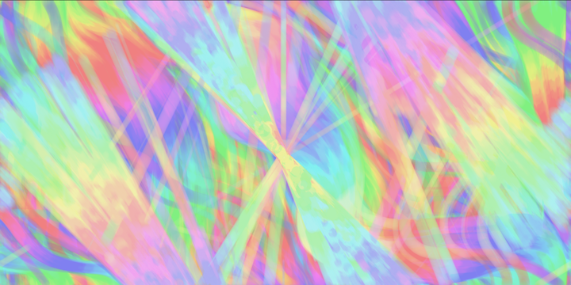
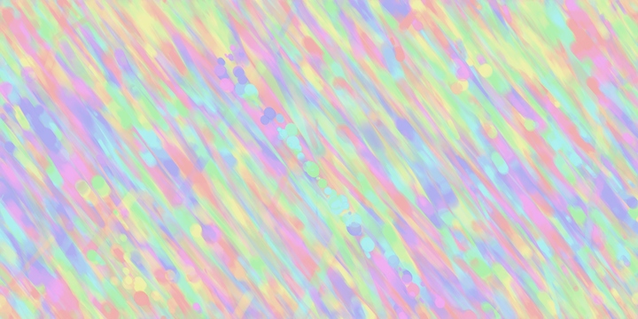
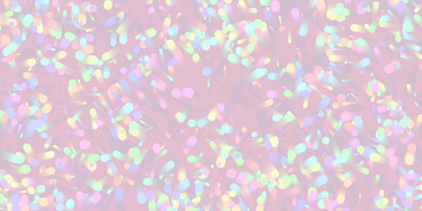
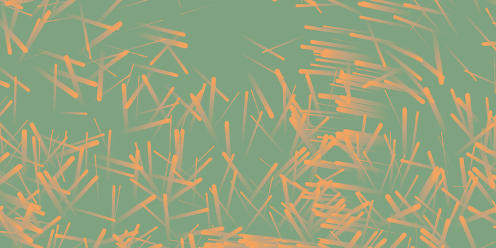
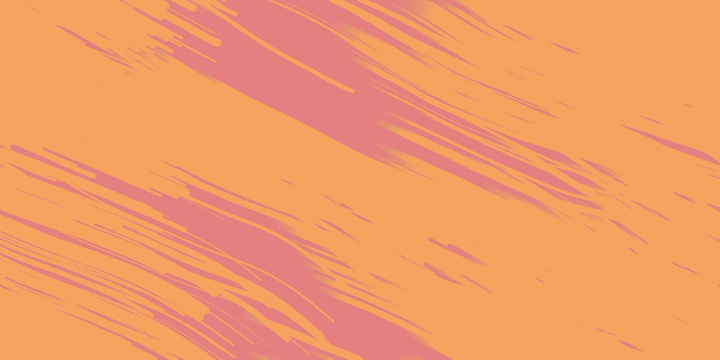
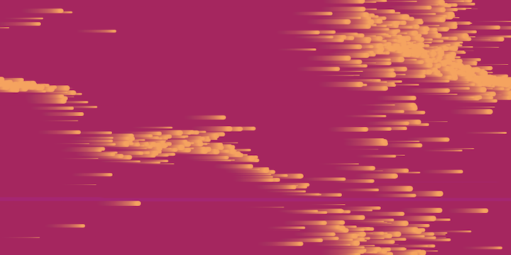
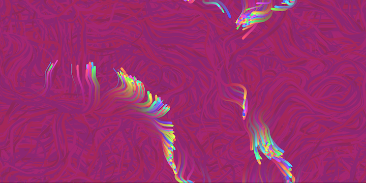

    
    

<!-- <button onclick="myFunction()">Toggle Text Visibility</button> -->

##### Try pressing ***'s'*** on your keyboard to bring up sketch manipulation options.

##### Take a snapshot of the canvas at any time by pressing ***'p'***.

##### Reload the page at any time to generate a new landscape. Just press 'CMD+R'.

A gathering of particle objects traverse the canvas. They are propelled by vector forces directly beneath their position. Try disabling 'enableFlowField' in the GUI options to see how the particles move without flow field forces.

# Sketch Manipulation Descriptions:

**Press** *s* **to bring up sketch manipulation options.**

- backgroundC:
##### Set the color for the background the to be rendered by using a simple color-picker interface.

- backgroundA:
##### Adjust the Alpha transparency of the background.

- strokeC:
##### Set the color for the stroke to be rendered by using a simple color-picker interface.

- strokeA:
##### Adjust the Alpha transparency of the stroke color.

- fillC:
##### Set the color for the casted rays to be rendered by using a simple color-picker interface.

  - ##### Note, fill only renders when using shapes, not lines.

- fillA:
##### Adjust the Alpha transparency of the rays.

  - ##### Note, fill only renders when using shapes, not lines.

- minSpeed:
##### The minimum random speed value a particle can pick when it re-enters the scene.

- maxSpeed:
##### The maximum random speed value a particle can pick when it re-enters the scene.

- angleVal:
##### The angle of rotation multiplied by the random noise values. Try setting this value to '0' to flatten the flow field vector angles.

- angleMult:
##### Multiple the 'angleVal' by a factor of this value.

- targetMagnitude:
##### Tune the strength of the mouse force applied to the particles when the screen is clicked.

- zoffAdjust:
##### Adjust the rate of noise change in the z-axis. The greater the rate of change, the more erratic the particles will be.

- incAdjust:
##### Adjust the rate of noise change in the x and y-axis. The greater the rate of change, the more erratic the particles will be.

- showFlowField:
##### Render the flow field on the canvas, with each vector in the field rendered as a line pointing towards its angle of rotation.

- enableFlowField:
##### Enable or disable flow field vector forces.

This flow field system is [based on an example from The Coding Train](https://thecodingtrain.com/CodingChallenges/024-perlinnoiseflowfield.html).

### Here are a few examples of stills created through this generator:

  
  
  
  
  
  

Project Resources can be found [here](/resources).
