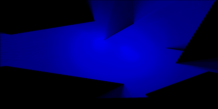
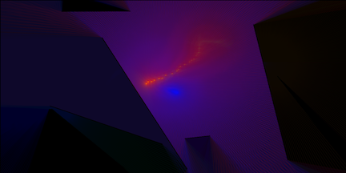
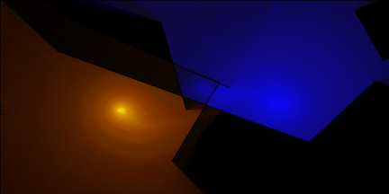
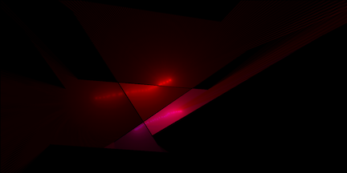

<div id="sketch-holder">
    <script type="text/javascript" src="sketch/sketch.js"></script>
    <script type="text/javascript" src="sketch/boundary.js"></script>
    <script type="text/javascript" src="sketch/particle.js"></script>
    <script type="text/javascript" src="sketch/ray.js"></script>
</div>

<!-- <button onclick="myFunction()">Toggle Text Visibility</button> -->

<!-- Include markdown="1" to allow markdown conversion within a div element. -->
<div id="pageText" markdown="1" style="visibility:visible">

###### Try pressing ```s``` on your keyboard to bring up sketch manipulation options.

###### Take a snapshot of the canvas at any time by pressing ```p```.

###### Reload the page at any time to generate a new landscape. Just press ```CMD+R```.

Particle objects cast rays out as they dance around a randomized landscape, creating dynamic play with light and shadow as they move. If a particle object passes through a wall, there is a chance for it to change color.

## GUI Variable Descriptions

- boundaryC:
##### Set the **color** for the boundaries to be rendered by using a simple color-picker interface.

- backgroundC:
##### Set the color for the background the to be rendered by using a simple color-picker interface.

- backgroundA:
##### Adjust the Alpha transparency of the background.

- randomizeRayColors:
##### If **randomizeRayColors** is enabled, the particles have a chance of picking random HSB values between their minimum values and 100. For example, adjusting **raySat** to 20 with **randomizeRayColors** enabled will allow the particles to randomly pick saturation values between 20 and 100 whenever they pass through a boundary.

- rayHue:
##### Set the **hue** for the casted rays via the color picker. This setting is overridden when **randomizeRayColors** is enabled.

- raySat:
##### Set the **saturation** for the casted rays. This setting is overridden when **randomizeRayColors** is disabled and saturation can be adjusted through the color-picker.
``` js
random(raySat, 100);
```

- rayBright:
##### Set the **brightness** for the casted rays. This setting is overridden when **randomizeRayColors** is disabled and brightness can be adjusted through the color-picker.  
``` js
random(rayBright, 100);
```

- rayAlpha:
##### Set the **alpha transparency** for the casted rays.

- numParticles:
##### Increase or decrease the number of active particle-objects in the scene. Increasing this value will decrease FPS.

- numRays:
##### Change the number of rays each particle sends out. Default is 360.

- rayIncrement:
##### **THIS FEATURE IS CURRENTLY DISABLED.** Increase or decrease the distance between casted rays.

- mouseFollowEnabled:
##### If enabled, one of the particles will follow the mouse around the scene when the mouse is pressed.


This 2D ray cast system is [based on an example by The Coding Train](https://www.youtube.com/watch?v=-6iIc6-Y-kk).

Another excellent tutorial on ray casting [by Red Blob Games is available here](https://www.redblobgames.com/articles/visibility/).

A third tutorial on ray casting [by ncase is available here](https://ncase.me/sight-and-light/).

### Here are a few examples of stills created through this generator:

  




</div>

<button onclick="renderPageText();">Toggle Page Text</button>
<button id="fsbutton" onclick="toggleFullScreen();">Toggle Full Screen</button>
